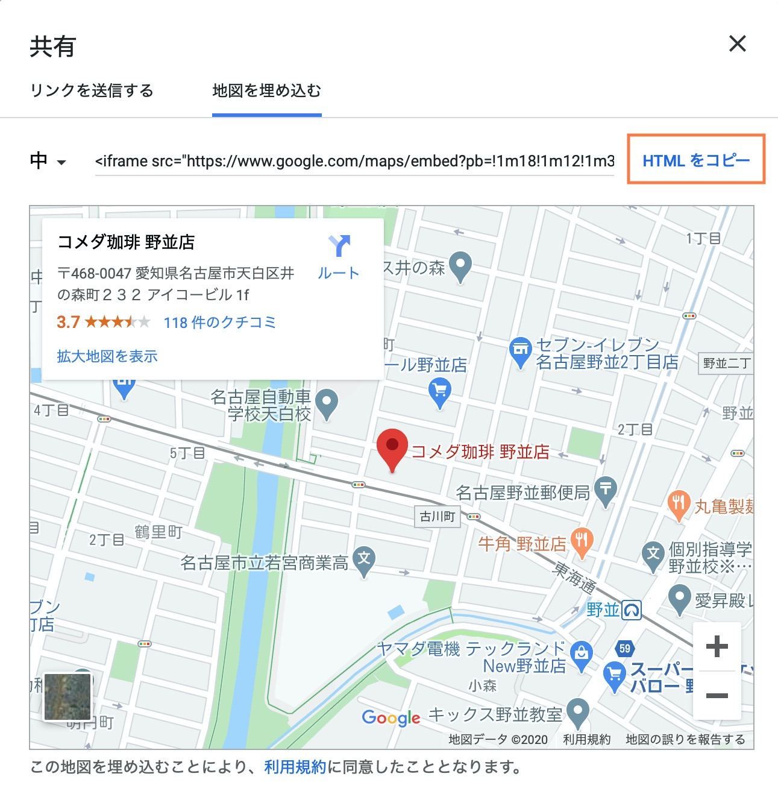

# Google Map の埋め込み

Webサイトを作っていく際に、自社への案内地図などを載せたい場面は多々あると思います。
例えば、次のような感じです。


ここでは、地図表示に良く使われている Google Map を、自分のWebサイトで使う方法をご紹介します。

## 準備
``` index.html ``` と ``` style.css ``` を次のように用意します。

###### index.html
```html
<!DOCTYPE html>
<html>
<head>
  <meta charset="utf-8">
  <meta name="viewport"
        content="width=device-width, initial-scale=1">
  <link rel="stylesheet" href="style.css">
</head>
<body>
  <h1>案内地図</h1>
  <div class="map">
    <div class="inner">
      <iframe src="https://www.google.com/maps/
                   embed?pb=!1m18!1m12!1m3!1d
                   3264.098229592375!2d136.94
                   909095223227!3d35.10425798
                   023631!2m3!1f0!2f0!3f0!3m2
                   !1i1024!2i768!4f13.1!3m3!1
                   m2!1s0x60037b0d5843e2af%3A
                   0x282e3c573e3f00d8!2z44Kz4
                   4Oh44OA54-I55CyIOmHjuS4puW
                   6lw!5e0!3m2!1sja!2sjp!4v15
                   92795030975!5m2!1sja!2sjp"
              style="border:0;">
      </iframe>
    </div>
  </div>
</body>
</html>
```

###### style.css
```css
.map {
  box-sizing: border-box;
  width: 100%;
}

.map .inner {
  overflow: hidden;
  position: relative;
  padding-top: 150%;
}
@media (min-width: 768px) {
  .map .inner {
    padding-top: calc(100% * 9 / 16);
  }
}

.map .inner iframe {
  position: absolute;
  top: 0;
  left: 0;
  width: 100%;
  height: 100%;
}
```

## 地図の埋め込み方法

1. Google Map
  https://www.google.co.jp/maps
  を開きます。

  

1. 左上の検索窓に、調べたい場所名や住所を入力します。
  

1. ここでは、「コメダ珈琲野並店」と入力し、虫眼鏡ボタンを押します。
  

1. コメダ珈琲 野並店が表示されました。
  埋め込むために必要なデータを表示させたいので、右下の「共有」ボタンを押します。
  

1. ここでは自分のWebサイトの中にGoogle Mapを埋め込みたいので、「地図を埋め込む」をクリックします。
  

1. 「HTMLをコピー」をクリックして、Atomに貼り付けます。
  

1. 不要な部分もあるので、必要な部分だけを残します。
  ##### 元のHTML
  ```html
    <iframe src="https://www.google.com/maps/
                 embed?pb=!1m18!1m12!1m3!1d
                 3264.098229592375!2d136.94
                 909095223227!3d35.10425798
                 023631!2m3!1f0!2f0!3f0!3m2
                 !1i1024!2i768!4f13.1!3m3!1
                 m2!1s0x60037b0d5843e2af%3A
                 0x282e3c573e3f00d8!2z44Kz4
                 4Oh44OA54-I55CyIOmHjuS4puW
                 6lw!5e0!3m2!1sja!2sjp!4v15
                 92795030975!5m2!1sja!2sjp"
                 width="600"
                 height="450"
                 frameborder="0"
                 style="border:0;"
                 allowfullscreen=""
                 aria-hidden="false"
                 tabindex="0">
    </iframe>
  ```

  ##### 必要な部分だけを残したHTML
  ```html
    <iframe src="https://www.google.com/maps/
                 embed?pb=!1m18!1m12!1m3!1d
                 3264.098229592375!2d136.94
                 909095223227!3d35.10425798
                 023631!2m3!1f0!2f0!3f0!3m2
                 !1i1024!2i768!4f13.1!3m3!1
                 m2!1s0x60037b0d5843e2af%3A
                 0x282e3c573e3f00d8!2z44Kz4
                 4Oh44OA54-I55CyIOmHjuS4puW
                 6lw!5e0!3m2!1sja!2sjp!4v15
                 92795030975!5m2!1sja!2sjp"
            style="border:0;">
    </iframe>
  ```
